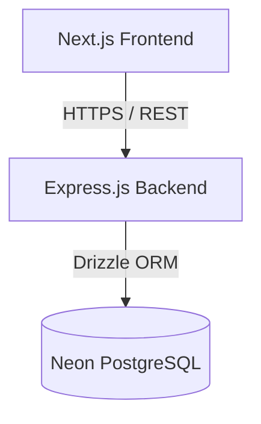

# Architecture Design Document - LALA Medical Complex HMS

This document outlines the software architecture, system boundaries, and design choices for the Hospital Management System (HMS).

## 1. System Topology
The system is designed as a decoupled, multi-tier application:
1. **Presentation Layer (Frontend):** Next.js (App Router) serving responsive client interfaces.
2. **Application Layer (Backend):** Express.js RESTful API handling business rules, validation, and authorization.
3. **Data Layer (Database):** PostgreSQL database hosted via Neon, orchestrated via Drizzle ORM.



## 2. Directory Structure & Feature-First Layout
We use a **Feature-First** structure. Rather than large global folders for all routes, controllers, and services, code is grouped inside isolated feature folders.

```
lala complex/
├── PRD.md
├── Architecture.md
├── Rules.md
├── Phases.md
├── Design.md
├── Memory.md
├── backend/                  # REST API Backend
│   ├── src/
│   │   ├── config/           # App-wide configurations (env, logger)
│   │   ├── db/               # Connection & global schemas
│   │   ├── middleware/       # Global middlewares (error, auth, rate limit)
│   │   ├── utils/            # Shared utility functions (errors, responses)
│   │   ├── features/         # Feature-first modules
│   │   │   └── auth/         # Modular Auth Feature
│   │   │       ├── auth.controller.ts
│   │   │       ├── auth.service.ts
│   │   │       └── auth.schema.ts
│   │   ├── app.ts            # App instantiation
│   │   └── server.ts         # Bootstrapper
│   ├── drizzle.config.ts
│   ├── tsconfig.json
│   └── package.json
└── frontend/                 # Next.js App Router Frontend
    ├── src/
    │   ├── app/              # Routing & global layouts
    │   │   ├── dashboard/    # Protected Dashboard Layout & Page
    │   │   ├── login/        # Auth Pages
    │   │   ├── layout.tsx
    │   │   └── page.tsx
    │   ├── components/       # Global UI / Shadcn wrappers
    │   │   └── ui/
    │   ├── hooks/            # Global custom React hooks
    │   ├── lib/              # Client wrappers (api-client, query-client)
    │   ├── styles/           # CSS & design system tokens
    │   ├── features/         # Feature-first sub-modules
    │   │   └── dashboard/    # Dashboard layout pieces (sidebar, headers)
    │   │       ├── components/
    │   │       ├── hooks/
    │   │       └── types/
    │   └── types/            # App-wide shared typings
    ├── tailwind.config.js
    ├── postcss.config.js
    ├── tsconfig.json
    └── package.json
```

## 3. Database Design & ORM Approach
- **Drizzle ORM:** Used for its type-safety, SQL-like query structure, and zero-overhead footprint.
- **Neon PostgreSQL:** A serverless PostgreSQL instance utilizing database branching and connection pooling.
- **Relationships:** Relations are explicitly modeled in schemas using Drizzle's relational mapping features (`relations`).
- **Migrations:** Managed via `drizzle-kit`. Migrations are generated declarative files stored in `backend/src/db/migrations` and run during server deployment/bootstrapping.

## 4. API Design & Response Formats
We enforce a standardized REST response contract to keep interaction with TanStack Query uniform:
- **Success Response:**
  ```json
  {
    "success": true,
    "data": { ... },
    "message": "Operation completed successfully"
  }
  ```
- **Error Response:**
  ```json
  {
    "success": false,
    "error": {
      "code": "BAD_REQUEST",
      "message": "Validation failed",
      "details": [ ... ]
    }
  }
  ```

## 5. Authentication & RBAC Flow
The system utilizes a secure JWT access/refresh token pattern:
1. **Login:** User credentials verified. Server signs short-lived (15m) access token (in memory / payload) and a long-lived (7d) refresh token (stored in a secure, `HttpOnly`, same-site cookie).
2. **Accessing Routes:** Frontend attaches access token to `Authorization: Bearer <token>` header.
3. **Expiry Handler:** Frontend axios/fetch interceptor detects a `401 Unauthorized` response, issues a token refresh request using the cookie, retries original request with new access token.
4. **RBAC Security Middleware:** Each endpoint defines allowed roles (e.g. `authorize(['SuperAdmin', 'Doctor'])`).

## 6. Frontend State Management
- **TanStack Query (React Query):** Serves as the primary cache and state synchronizer for server data.
- **React Context:** Used for simple local UI state (e.g. Sidebar toggle state).
- **Zustand (Optional / Future):** Will be introduced only if complex global client-side state is required.

## 7. Scalability & Architectural Decoupling
To ensure modules do not tightly couple:
- **No Direct Imports:** `features/patients` must never import files from `features/billing` directly.
- **Decoupled Comm:** Services should emit events or call shared registry services for cross-feature queries.
- **Modular Database Schemas:** Schemas can be split across feature folders (e.g., `features/billing/billing.schema.ts`) and imported into the core `schema.ts` entry point for database setup.
